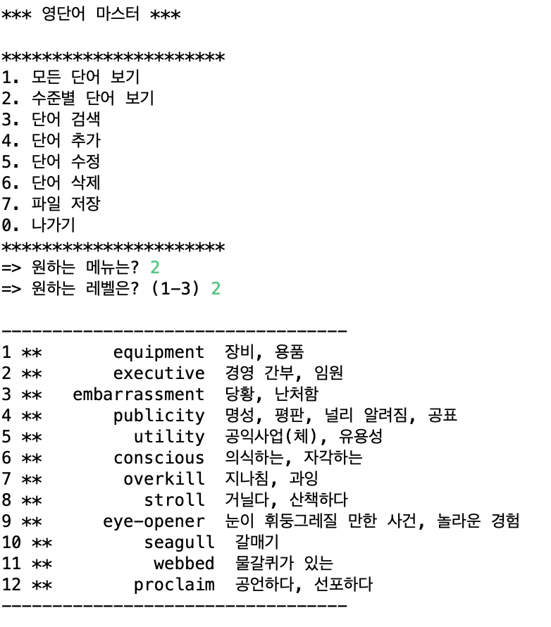
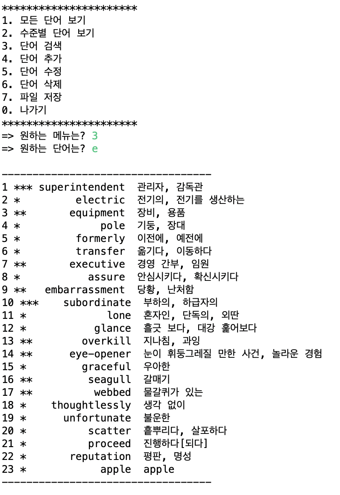
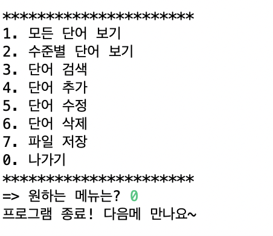

📖 영단어 마스터 프로그램 📖
=======================

프로그램이 시작하면 메뉴에서 원하는 번호를 누르세요-!

### 1️⃣ 모든 단어보기
현재 저장되어 있는 모든 단어를 출력

⬇️ 실행 화면

### 2️⃣ 수준별 단어보기

⬇️ 실행 화면

### 3️⃣ 단어 검색

⬇️ 실행 화면

### 4️⃣ 단어 추가
단어를 프로그램에 추가한다
단어의 난이도를 1, 2, 3 중에서 선택하고, 단어를 입력한 후 뜻을 입력하기

⬇️ 실행 화면

### 0️⃣ 나가기
종료 메세지 '프로그램 종료! 다음에 만나요~'를 출력하고 프로그램을 종료

⬇️ 실행 화면

